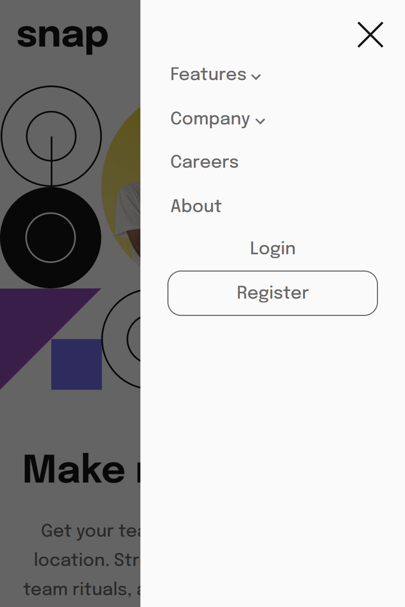

# Seção introdutória com navegação suspensa
Projeto para realizar uma seção introdutoria com navegação suspensa em HTML, CSS e JavaScript, responsiva para mobile (375px) e desktop (1440px)

## Índice

- [Visão geral](#visao-geral)
  - [O Desafio](#o-desafio)
  - [Screenshot](#screenshot)
- [Minha caminhada](#minha-caminhada)
  - [Propriedades](#propriedades)
  - [O que aprendi](#o-que-aprendi)
  - [Recursos](#recursos)
- [Autor](#autor)

## Visão Geral

### O Desafio

Os usuários devem ser capazes de:

- Vizualizar o layout ideal para o site, dependendo do tamanho da tela do dispositivo, mobile (375px) ou desktop (1440px)
- Vizualizar os estados de foco para todos os elementos interativos na página

### Screenshots

<html>
    <h4>Layout mobile</h4>
    
    <h4>Menu mobile</h4>
    
    <h4>Submenu mobile</h4>
    
    <h4>Layout desktop</h4>
    
    <h4>Submenu desktop</h4>
    
</html>

## Minha caminhada

- [x] Preparativos da pagina HTML e CSS para mobile
- [x] Barra de navegação
- [x] Layout versão mobile
- [x] Layout versão desktop
- [x] Menus de nagavegação
- [x] Elementos JavaScript
- [x] Estados de foco

### Propriedades

- Mobile-first
- Semântica HTML
- CSS BEM
- CSS Flexbox
- CSS Grid
- CSS Reaproveitável, limpo e flexível

### Meu aprendizado
Durante a elaboração da solução, me deparei com a necessidade de criar um menu hambúrguer para a versão mobile, porém, havia uma particularidade que ainda não tinha me deparado. Ao abrir o menu, o layout por trás, deveria receber um desfoque como uma espécie de sombreamento acinzentado. 

Encontrei uma solução, que é utilizada na criação de modais, onde se utiliza em HTML uma div fazia, comumente chamada de "fade", com propriedades de CSS que torne o background preto, mas com opacidade em 0.6, uma posição fixa que ocupe toda a tela, referenciando o mesmo, entre o layout e o menu, com a propriedade z-index. Em JavaScript foi necessário incluir uma classe no elemento, para que só fosse visível ao abrir o menu.

Trechos de destaque:

HTML
```html
...
<!-- Botão do menu hamburguer mobile -->
            <div class="nav__container-menu">
                <button class="nav__menu-botton" id="open-menu">
                    
                </button>
            </div>

        </nav>

        <!-- Sombra de desfoque do layout mobile ao abrir menu -->
        <div class="fade hide"></div>

        <!-- Menu hamburguer mobile -->
        <div class="mobile__menu hide">
...
```
CSS
```css
.mobile__menu,
.fade {
    transition: 0.5s;
    opacity: 1;
    pointer-events: all;
}

.fade {
    position: fixed;
    top: 0;
    left: 0;
    width: 100%;
    height: 100%;
    background-color: rgba(0, 0, 0, 0.6);
    z-index: 5;
}

.mobile__menu {
    background: var(--branco);
    position: fixed;
    right: 0;
    top: 0;
    padding: 1.2rem;
    width: 55%;
    height: 100vh;
    z-index: 10;
}

.hide {
    opacity: 0;
    pointer-events: none;
}
```
JavaScript
```javascript
const openMenuButton = document.querySelector("#open-menu");
const closeMenuButton = document.querySelector("#close-menu");
const menu = document.querySelector(".mobile__menu");
const fade = document.querySelector(".fade");

const toggleMenu = () => {
    menu.classList.toggle("hide");
    fade.classList.toggle("hide");
}

[openMenuButton, closeMenuButton, fade].forEach((elementos) => {
    elementos.addEventListener("click", () => toggleMenu())
})
```

### Recursos

- [CSS - Blocos, Elementos e Modificadores](https://getbem.com/introduction/) - Este é um artigo que vai te fazer entender a boa prática, para nomear as suas classes.

- [CSS - z-index](https://www.alura.com.br/artigos/capturando-valor-do-input-introducao-a-seletores) - Este é um artigo que vai te fazer entender um pouco mais da propriedade.

- [JavaScript - Introdução a seletores](https://www.alura.com.br/artigos/capturando-valor-do-input-introducao-a-seletores) - Este é um artigo relevante para quem deseja iniciar seu aprendizado na linguagem.

- [JavaScript - toggle](https://developer.mozilla.org/en-US/docs/Web/API/DOMTokenList/toggle) - Este é um artigo que fala desse método da DOMTokenList.

- [O desafio da Frontend Mentor](https://www.frontendmentor.io/challenges/intro-section-with-dropdown-navigation-ryaPetHE5) - Neste link você encontrará o desafio que foi solucionado aqui.

## Autor

- LinkedIn - [Pedro A. Lima](https://www.linkedin.com/in/pedrolima626/)
