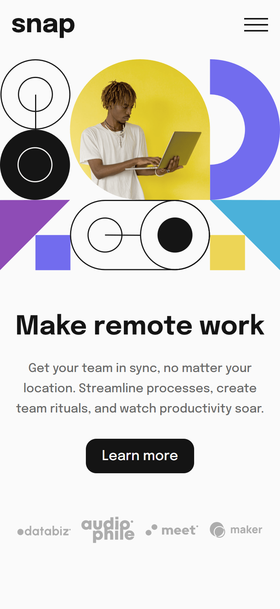

# Seção introdutória com navegação suspensa
Projeto para realizar uma seção introdutoria com navegação suspensa em HTML, CSS e JavaScript, responsiva para mobile (375px) e desktop (1440px)

## Índice

- [Visão geral](#visao-geral)
  - [O Desafio](#o-desafio)
  - [Screenshot](#screenshot)
- [Minha caminhada](#minha-caminhada)
  - [Propriedades](#propriedades)
  - [O que aprendi](#o-que-aprendi)
  - [Recursos](#recursos)
- [Autor](#autor)

## Visão Geral

### O Desafio

Os usuários devem ser capazes de:

- Vizualizar o layout ideal para o site, dependendo do tamanho da tela do dispositivo, mobile (375px) ou desktop (1440px)
- Vizualizar os estados de foco para todos os elementos interativos na página

### Screenshots

<html>
    
    
    
    
</html>

## Minha caminhada

- [x] Preparativos da pagina HTML e CSS para mobile
- [x] Barra de navegação
- [x] Layout versão mobile
- [x] Layout versão desktop
- [x] Menus de nagavegação
- [x] Elementos JavaScript
- [ ] Estados de foco

### Propriedades

- Mobile-first
- Semântica HTML
- CSS BEM
- CSS Flexbox
- CSS Grid
- CSS Reaproveitável, limpo e flexível


### Meu aprendizado

Trechos de destaque:

HTML
```html
...
  <div class="nav__container-menu">
    <botton class="nav__menu-botton" id="open-menu">
      
    </botton>
  </div>
</nav>
<div class="fade hide"></div>
<div class="mobile__menu hide">
  <div class="mobile__container-menu">
    <botton class="nav__menu-botton" id="close-menu">
      
    </botton>
  </div>
</div>
```
CSS
```css
.mobile__menu,
.fade {
    transition: 0.5s;
    opacity: 1;
    pointer-events: all;
}

.fade {
    position: fixed;
    top: 0;
    left: 0;
    width: 100%;
    height: 100%;
    background-color: rgba(0, 0, 0, 0.6);
    z-index: 5;
}

.mobile__menu {
    background: var(--branco);
    position: fixed;
    right: 0;
    top: 0;
    padding: 1.2rem;
    width: 55%;
    height: 100vh;
    z-index: 10;
}

.hide {
    opacity: 0;
    pointer-events: none;
}
```
JavaScript
```javascript
const openMenuButton = document.querySelector("#open-menu");
const closeMenuButton = document.querySelector("#close-menu");
const menu = document.querySelector(".mobile__menu");
const fade = document.querySelector(".fade");

const toggleMenu = () => {
    menu.classList.toggle("hide");
    fade.classList.toggle("hide");
}

[openMenuButton, closeMenuButton, fade].forEach((elementos) => {
    elementos.addEventListener("click", () => toggleMenu())
})
```

### Recursos

- [JavaScript - Introdução a seletores](https://www.alura.com.br/artigos/capturando-valor-do-input-introducao-a-seletores) - Este é um artigo relevante para quem deseja iniciar seu aprendizado na linguagem.

- [O desafio da Frontend Mentor](????) - Neste link você encontrará o desafio que foi solucionado aqui.

## Autor

- LinkedIn - [Pedro A. Lima](https://www.linkedin.com/in/pedrolima626/)
